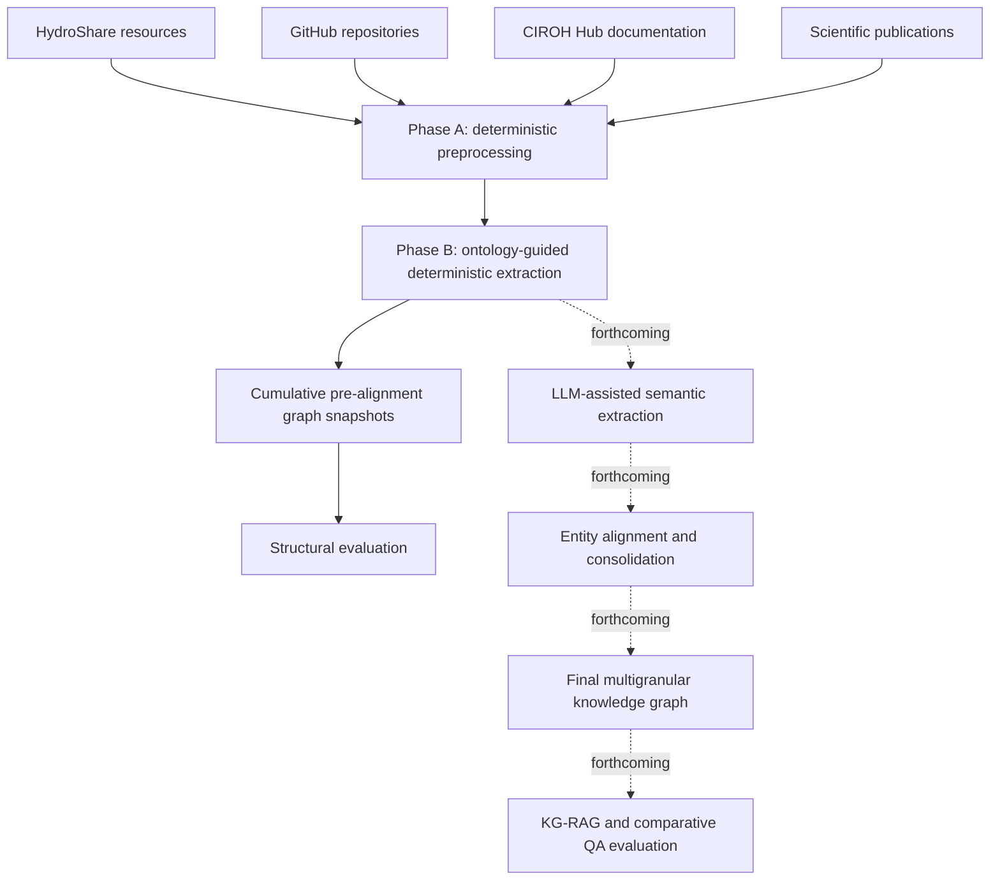

# Multigranular KG-RAG for Operational Hydrology

> **Project status:** Active doctoral dissertation research. Ontology v0.1.3 and the deterministic extraction layer are complete and frozen. The Publication LLM target inventory is complete and frozen; Publication Pilot 1 contracts and implementation are next/in progress, while LLM-assisted semantic extraction execution, cross-source alignment, final graph assembly, retrieval, and comparative question-answering evaluation are not yet completed.

This repository supports the construction and evaluation of an ontology-guided, multigranular knowledge graph and KG-RAG system for **scientific cross-artifact question answering in operational hydrology**.

Scientific knowledge is distributed across publications, datasets, source-code repositories, and technical documentation. The project represents these heterogeneous artifacts in a common, provenance-aware graph while preserving both:

- **inter-artifact structure**, such as connections among papers, datasets, repositories, tools, organizations, and documentation; and
- **intra-artifact structure**, such as sections, files, contributors, dependencies, variables, methods, evidence spans, and other artifact-specific components.

The current corpus is centered on artifacts associated with the **Cooperative Institute for Research to Operations in Hydrology (CIROH)**.

## Research scope

The repository supports two connected dissertation studies:

1. **Ontology and multigranular knowledge-graph construction** over heterogeneous scientific artifacts.
2. **Scientific workflow-aware graph retrieval and KG-RAG** for cross-artifact question answering in operational hydrology.

The intended final system will be evaluated against non-retrieval, web-search, vector-RAG, and GraphRAG baselines built under a controlled comparison design.

## Current milestone

| Component | Status |
|---|---|
| Conceptual ontology design | Complete |
| OWL/RDF formalization | Complete — v0.1.3 frozen |
| HermiT validation | Complete |
| ELK cross-check | Complete — profile-limited technical cross-check |
| HydroShare deterministic extraction | Complete |
| GitHub deterministic extraction | Complete |
| CIROH Hub deterministic extraction | Complete |
| Publication deterministic extraction | Complete |
| Cumulative structural evaluation | Complete for the deterministic pre-alignment trajectory |
| Publication LLM target inventory | Complete and frozen |
| Publication Pilot 1 contracts and implementation | Next/in progress |
| LLM-assisted semantic extraction execution | Not yet completed |
| Cross-source entity alignment and consolidation | Planned |
| Final graph assembly and graph-database loading | Planned |
| GraphRAG baseline | Planned |
| KG-RAG retrieval and QA evaluation | Planned |

## Pipeline



Phase A parses and normalizes source-specific records without creating graph entities. Phase B applies frozen mappings to create ontology-aligned nodes, edges, attributes, and provenance records. The current cumulative snapshots concatenate deterministic modules without semantic deduplication; alignment and consolidation are later stages.

## Frozen ontology

The current ontology release is **v0.1.3**, formally frozen.

- Generated artifact: [`src/ontology/ciroh_ontology.owl`](src/ontology/ciroh_ontology.owl)
- Machine-readable specification: [`src/ontology/ontology_spec.yaml`](src/ontology/ontology_spec.yaml)
- Generator: [`src/ontology/build_ontology.py`](src/ontology/build_ontology.py)
- SHA-256: `ecfcd7058b3404dd1a02875654cc8c7f905e20bdf2e559b4498aa2e7d0f12a57`
- Source class declarations: 75
- Source relation declarations: 125
- Minted CIROH classes: 51
- Referenced external classes: 22
- Object properties: 90
- Datatype properties: 18
- Direct OWL imports: 6

Ontology v0.1.3 passed the authoritative manual HermiT gate in Protégé: HermiT
completed successfully, found the ontology consistent, inferred no named classes under
`owl:Nothing`, and reported no execution errors. The technical ELK cross-check and its
profile limitations are recorded in the formalization document.

See [`docs/ontology_formalization.md`](docs/ontology_formalization.md) for the complete formalization and validation record.

## Deterministic graph trajectory

The current full cumulative deterministic snapshot contains:

| Construction point | Nodes | Edges |
|---|---:|---:|
| HydroShare | 1,288 | 1,613 |
| + GitHub | 13,996 | 14,283 |
| + CIROH Hub | 18,663 | 20,836 |
| + Publications | 28,319 | 32,608 |

These are **pre-alignment** snapshots. A node consolidation ratio of 1.0 at this stage reflects mention-level representation before cross-source entity resolution.

The repository reports two structural views:

- `full`: the primary description of the actual deterministic graph; and
- `file_inventory_excluded`: a supporting sensitivity analysis that excludes ontology classes used for explicit file inventories.

The filtered view does not modify the KG and is not a substitute for the full graph. See [`results/metrics/trajectory.md`](results/metrics/trajectory.md) and [`docs/evaluation_decisions.md`](docs/evaluation_decisions.md).

## Repository organization

```text
data/
  curation/                     Version-controlled curation decisions
  raw/                          Locally materialized source snapshots
  interim/                      Generated corpora and graph artifacts, generally ignored

docs/                            Ontology, preprocessing, extraction, and evaluation records

notebooks/                       Corpus acquisition and exploratory workflows

results/metrics/
  modules/                       Module-level structural metric records
  snapshots/                     Cumulative metric snapshots
  trajectory.md                 Human-readable deterministic trajectory

src/
  ontology/                      Ontology specification, builder, imports, and OWL artifact
  preprocessing/                 Source-specific deterministic Phase A corpus builders
  extraction/deterministic/      Phase B extractors and mapping contracts
  evaluation/                    Snapshot assembly and structural metrics

tests/                           Unit, regression, contract, and frozen-snapshot tests
```

## Documentation map

### Ontology

- [Conceptual ontology](docs/ontology_v0.1.md)
- [Ontology inventory](docs/ontology_inventory.md)
- [OWL/RDF formalization and reasoner validation](docs/ontology_formalization.md)

### GitHub repositories

- [Phase A preprocessing record](docs/github_preprocessing_phaseA.md)
- [Phase B deterministic extraction record](docs/github_extraction_phaseB.md)
- [Extraction mapping](src/extraction/deterministic/github_extraction_mapping.md)

### CIROH Hub documentation

- [Phase A preprocessing record](docs/ciroh_hub_preprocessing_phaseA.md)
- [Phase B deterministic extraction record](docs/ciroh_hub_extraction_phaseB.md)
- [Extraction mapping](src/extraction/deterministic/ciroh_hub_extraction_mapping.md)

### Publications

- [Phase A preprocessing record](docs/publication_preprocessing_phaseA.md)
- [Phase B deterministic extraction record](docs/publication_extraction_phaseB.md)
- [Extraction mapping](src/extraction/deterministic/publication_extraction_mapping.md)
- [Final Publication Pilot 1 LLM target inventory](docs/publication_llm_extraction_target_inventory.md)
- [Final publication ontology observations register](docs/publication_ontology_observations_register.md)

### Evaluation

- [Evaluation decisions](docs/evaluation_decisions.md)
- [Structural metrics trajectory](results/metrics/trajectory.md)

## Working with the current code

The repository currently provides source-specific scripts rather than a single end-to-end command.

Create the preprocessing environment:

```bash
conda env create -f src/preprocessing/environment.yml
conda activate github-preprocessing
```

Inspect the available command-line options before running a module:

```bash
python src/preprocessing/build_github_corpus.py --help
python src/preprocessing/build_ciroh_hub_corpus.py --help
python src/preprocessing/build_publication_corpus.py --help

python src/extraction/deterministic/extract_github.py --help
python src/extraction/deterministic/extract_ciroh_hub.py --help
python src/extraction/deterministic/extract_publication.py --help

python src/evaluation/build_cumulative_snapshot.py --help
python src/evaluation/compute_structural_metrics.py --help
```

Run the automated tests from a compatible project environment:

```bash
python -m pytest
```

Some ontology-focused checks require Owlready2 and an appropriate Java/reasoner environment. Manual Protégé reasoner results are documented rather than reproduced automatically by the default preprocessing environment.

## Data and reproducibility

Large raw snapshots and generated interim artifacts are not all version-controlled. The repository instead versions:

- deterministic source code;
- ontology and extraction contracts;
- curation decisions;
- frozen metric records;
- regression tests; and
- methodological documentation.

Source-specific Phase A and Phase B documents define the expected inputs, outputs, validation anchors, exclusions, and provenance policies needed to rebuild the current deterministic artifacts.

External source materials remain subject to their original terms of use and licenses.

## Roadmap

- [x] Freeze ontology v0.1.3
- [x] Complete deterministic extraction for the four artifact families
- [x] Record the cumulative deterministic structural trajectory
- [x] Freeze the Publication Pilot 1 LLM target inventory
- [ ] Complete Publication Pilot 1 contracts and implementation
- [ ] Execute ontology-guided LLM-assisted semantic extraction
- [ ] Align and consolidate entities across artifact families
- [ ] Assemble and load the final multigranular KG
- [ ] Build the Microsoft GraphRAG comparison baseline
- [ ] Implement scientific workflow-aware KG retrieval
- [ ] Evaluate retrieval and answer quality against all baselines
- [ ] Add release-level installation, reproduction, and citation instructions

## Citation

This repository supports ongoing doctoral dissertation research. A formal software and publication citation will be added when the corresponding study is released.

Until then, please cite the repository with the author, repository title, year, and the specific commit or release used.

## License

Except where otherwise noted, original code and documentation in this repository are available under the [MIT License](LICENSE).

Third-party ontologies, source materials, and external corpus artifacts retain their original licenses and are not relicensed under MIT. See [THIRD_PARTY_NOTICES.md](THIRD_PARTY_NOTICES.md).

## Research context and disclaimer

This is an independent doctoral research repository developed at The University of Alabama. It uses CIROH-related artifacts as a research corpus but should not be interpreted as an official CIROH software release or as an endorsement by CIROH, its partner institutions, or the publishers of the source artifacts.
