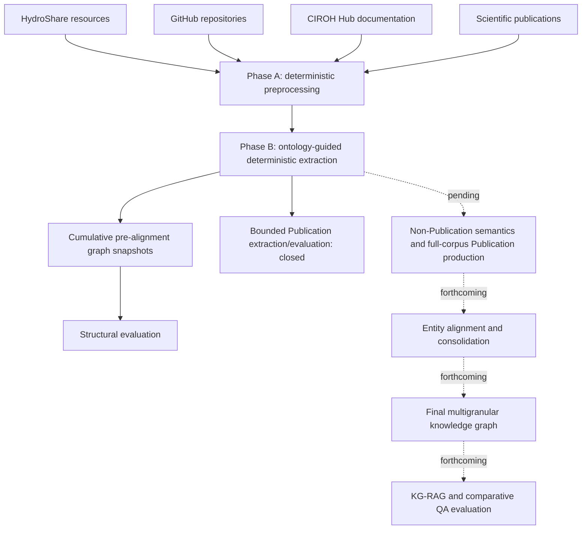

# Multigranular KG-RAG for Operational Hydrology

> **Project status — October 8, 2026:** Active doctoral dissertation research. Study 2 Step 10 is closed and ontology v0.1.6 is formally frozen. The accepted deterministic pre-alignment baseline contains 28,406 nodes and 32,809 edges. Bounded Publication Human Core N=5, complementary N=6 review, and SciERC external evaluations are closed. Step 11 source-specific semantic extraction contract design is next; non-Publication semantic extraction, full-corpus Publication semantic production, alignment, final KG assembly, and Study 3 retrieval/QA remain pending.

This repository supports the construction and evaluation of an ontology-guided, multigranular knowledge graph and KG-RAG system for **scientific cross-artifact question answering in operational hydrology**.

Scientific knowledge is distributed across publications, datasets, source-code repositories, and technical documentation. The project represents these heterogeneous artifacts in a common, provenance-aware graph while preserving both:

- **inter-artifact structure**, such as connections among papers, datasets, repositories, tools, organizations, and documentation; and
- **intra-artifact structure**, such as sections, files, contributors, dependencies, variables, methods, evidence spans, and other artifact-specific components.

The current corpus is centered on artifacts associated with the **Cooperative Institute for Research to Operations in Hydrology (CIROH)**.

## Research scope

The repository supports two connected dissertation studies:

1. **Ontology and multigranular knowledge-graph construction** over heterogeneous scientific artifacts.
2. **Scientific workflow-aware graph retrieval and KG-RAG** for cross-artifact question answering in operational hydrology.

The intended final system will be evaluated against non-retrieval, web-search, vector-RAG, and GraphRAG baselines built under a controlled comparison design.

## Current milestone

| Component | Accepted status |
|---|---|
| Ontology formalization and HermiT gate | v0.1.6 formally frozen; validation limitations below |
| Four-family deterministic extraction | Accepted pre-alignment baseline; HydroShare v0.1.6 corrections and GitHub/Hub reference enrichment accepted |
| Cumulative structural evaluation | Recorded for the current deterministic baseline and inventory-excluded sensitivity |
| Step 7 — Publication Human Core N=5 | Frozen/closed; strict evaluation primary, researcher-reviewed results secondary |
| Step 8 — complementary Publication N=6 review | Accepted/frozen/closed; candidate-conditioned review, not exhaustive extraction evaluation |
| Step 9 — SciERC external evaluation | Accepted/frozen/closed; strict/post-run results and separately qualified secondary analyses |
| Step 10 — source-specific semantic-gap decisions | Closed |
| Step 11 — source-specific semantic extraction contract design | Next; pending |
| Steps 12–18 | Pending under their respective accepted plans; Study 2 is not complete |

The bounded Publication evaluations have produced extraction/evaluation artifacts, **not the final full-corpus Publication semantic production graph**. Full-corpus Publication semantic production remains a distinct prerequisite for Step 13 completion.

- [Step 7 closure](data/curation/papers/m2/human_core_gold/publication_human_core_n5_corrected_evaluation_step7c_closure_v1.0.0.md) preserves the corrected evaluation against the bounded, model-blind Human Core N=5 reference and the primary/secondary distinction.
- [Step 8 acceptance](docs/evaluation_decisions.md#step-8-researcher-acceptance--accepted--frozen_closed) binds the [frozen closure](data/curation/papers/m2/publication_step8_final_evaluation/publication_step8_closure_freeze_v1.0.0.json). Two independent reviews covered the same 182 candidates across N=6 before joint reconciliation; 179 assertions were supported (130 nodes, 49 relations). Candidate-support agreement is not extraction inter-annotator agreement, and this review does not establish recall or completeness.
- [Step 9 closure](data/curation/papers/m2/scierc_step9_closure_v0.1.0.json) retains the disclosed failure-handling policies. Mechanical-overlap sensitivity is not semantic adjudication; LLM-assisted contextual equivalence is secondary analysis, not independently human-adjudicated gold or a replacement extraction score.

## Pipeline


```mermaid
flowchart TD
    A[HydroShare resources] --> P1[Phase A: deterministic preprocessing]
    B[GitHub repositories] --> P1
    C[CIROH Hub documentation] --> P1
    D[Scientific publications] --> P1

    P1 --> P2[Phase B: ontology-guided deterministic extraction]
    P2 --> S[Cumulative pre-alignment graph snapshots]
    S --> E[Structural evaluation]

    P2 --> B1[Bounded Publication extraction/evaluation: closed]
    P2 -. pending .-> L[Non-Publication semantics and full-corpus Publication production]
    L -. forthcoming .-> M[Entity alignment and consolidation]
    M -. forthcoming .-> G[Final multigranular knowledge graph]
    G -. forthcoming .-> R[KG-RAG and comparative QA evaluation]
```

Phase A parses and normalizes source-specific records without creating graph entities. Phase B applies frozen mappings to create ontology-aligned nodes, edges, attributes, and provenance records. The current cumulative snapshots concatenate deterministic modules without semantic deduplication; alignment and consolidation are later stages.

## Current ontology

The current prospective ontology baseline is **v0.1.6, formally frozen**. Historical Publication deterministic, production, annotation, and evaluation authorities retain their original version bindings; this freeze does not migrate or rewrite them.

- Generated artifact: [`src/ontology/ciroh_ontology.owl`](src/ontology/ciroh_ontology.owl)
- Machine-readable specification: [`src/ontology/ontology_spec.yaml`](src/ontology/ontology_spec.yaml)
- Generator: [`src/ontology/build_ontology.py`](src/ontology/build_ontology.py)
- Validated OWL SHA-256: `6ebf7f67f79d8aae4fada176911ed9311964beb567f40a097af9017f1ad9c730`
- Source declarations: 77 classes and 130 relations; 53 minted CIROH classes and 22 referenced external classes; 92 object properties, 20 datatype properties, and 6 direct OWL imports.

The recorded focused ontology suite passed 44 tests, including byte-identical builds and historical signature compatibility. On October 7, 2026, classification in Protégé 5.6.5 with HermiT 1.4.3.456 completed with no reported inconsistency or HermiT exception; the researcher confirmed zero named unsatisfiable classes under `owl:Nothing`.

This result applies to the exact artifact and import configuration available in that session, **not a fully resolved third-party import closure**. Some catalog lookups fell back to successful remote loading; DataCite's transitive `literalreification` import failed. Imported DCMI/PROV-O/SKOS vocabularies produced property-punning and annotation-property transformation warnings. The Fact++ plugin failed to start, while HermiT completed independently. Structural compatibility does not establish reasoner validation of every saved instance graph, scientific validity of extracted claims, or service availability. See [formalization §12](docs/ontology_formalization.md#12-study-2-step-10-additive-amendment-016-formally-frozen).

## Deterministic graph trajectory

The current full cumulative deterministic snapshot contains:

| Construction point | Nodes | Edges |
|---|---:|---:|
| HydroShare (v0.1.6 corrections) | 1,303 | 1,628 |
| + GitHub (reference enrichment) | 14,083 | 14,393 |
| + CIROH Hub (reference enrichment) | 18,750 | 21,037 |
| + Publications | 28,406 | 32,809 |

These are **pre-alignment** snapshots. A node consolidation ratio of 1.0 at this stage reflects mention-level representation before cross-source entity resolution.

The repository reports two structural views:

- `full`: the primary description of the actual deterministic graph; and
- `file_inventory_excluded`: a supporting sensitivity analysis that excludes ontology classes used for explicit file inventories.

The final file-inventory-excluded view contains **15,705 nodes and 19,866 edges**. The filtered view does not modify the KG and is not a substitute for the full graph. See [`results/metrics/trajectory.md`](results/metrics/trajectory.md) and [`docs/evaluation_decisions.md`](docs/evaluation_decisions.md).

The [accepted HydroShare corrections](docs/handoffs/STUDY2_HYDROSHARE_V016_ACCEPTANCE.md) added 15 own-resource DOI Identifier/hasIdentifier pairs and aligned 18 contributor and 21 funding-agency edges to C-D27/C-D28 without changing their relation semantics or endpoints. The [accepted reference enrichment](docs/handoffs/STUDY2_REFERENCE_ENRICHMENT_V1_ACCEPTANCE.md) adds **59 GitHub C-C27 referencesRepository edges** and **91 Hub C-DC22 references edges**. Generic references do not establish use, implementation, dependency, identity, scientific correctness, or exhaustive coverage. Exact accepted graph hashes are in the [prospective manifest](tests/fixtures/reference_enrichment/prospective_hashes.json).

`DataService`/`servesDataset` are declared in the ontology, but service extraction is not activated. Heuristically generated HydroShare `data_services` are not verified WMS/WCS service assertions and are not admissible evidence for published services; service materialization remains deferred.

## Repository organization

```text
data/
  curation/                     Version-controlled curation decisions
  raw/                          Locally materialized source snapshots
  interim/                      Generated corpora and graph artifacts, generally ignored

docs/                            Ontology, preprocessing, extraction, and evaluation records

notebooks/                       Corpus acquisition and exploratory workflows

results/metrics/
  modules/                       Module-level structural metric records
  snapshots/                     Cumulative metric snapshots
  trajectory.md                 Human-readable deterministic trajectory

src/
  ontology/                      Ontology specification, builder, imports, and OWL artifact
  preprocessing/                 Source-specific deterministic Phase A corpus builders
  extraction/deterministic/      Phase B extractors and mapping contracts
  evaluation/                    Snapshot assembly and structural metrics

tests/                           Unit, regression, contract, and frozen-snapshot tests
```

## Documentation map

### Ontology

- [Conceptual ontology](docs/ontology_v0.1.md)
- [Ontology inventory](docs/ontology_inventory.md)
- [OWL/RDF formalization and reasoner validation](docs/ontology_formalization.md)

### GitHub repositories

- [Phase A preprocessing record](docs/github_preprocessing_phaseA.md)
- [Phase B deterministic extraction record](docs/github_extraction_phaseB.md)
- [Extraction mapping](src/extraction/deterministic/github_extraction_mapping.md)

### CIROH Hub documentation

- [Phase A preprocessing record](docs/ciroh_hub_preprocessing_phaseA.md)
- [Phase B deterministic extraction record](docs/ciroh_hub_extraction_phaseB.md)
- [Extraction mapping](src/extraction/deterministic/ciroh_hub_extraction_mapping.md)

### Publications

- [Phase A preprocessing record](docs/publication_preprocessing_phaseA.md)
- [Phase B deterministic extraction record](docs/publication_extraction_phaseB.md)
- [Extraction mapping](src/extraction/deterministic/publication_extraction_mapping.md)
- [Final Publication Pilot 1 LLM target inventory](docs/publication_llm_extraction_target_inventory.md)
- [Publication Pilot 1 machine-readable target profile](src/extraction/llm/publications/publication_target_inventory.yaml)
- [Publication Pilot 1 source-unit contract](docs/publication_source_unit_contract.md)
- [Publication Pilot 1 source-unit builder implementation and materialization record](docs/publication_source_unit_builder_implementation.md)
- [Publication Pilot 1 candidate-output JSON Schema](schemas/publication_candidate_output.schema.json)
- [Publication Pilot 1 evidence-validation contract](docs/publication_evidence_validation_contract.md)
- [Publication Pilot 1 annotation and adjudication guidelines](docs/publication_annotation_adjudication_guidelines.md)
- [Publication Pilot 1 original evaluation matching contract](docs/publication_evaluation_matching_contract.md)
- [Publication Pilot 1 Block A screening, routing, selection, and Gate-0 record](docs/publication_pilot1_block_a_screening_routing_selection.md)
- [Publication Pilot 1 local screening interface MVP](docs/publication_pilot1_screening_interface.md)
- [Publication Pilot 1 screening handbook — version 0.1.1 frozen; SHA-256 `c8a8099286871e22616022b5964ef42b10e251601131732968977fcfc3711bc2`](docs/publication_pilot1_screening_handbook.md)
- [Historical Publication Pilot 1 sample and input freeze record](docs/publication_pilot1_sample_input_freeze.md)
- [Amended Human Core matching contract](docs/publication_human_core_amended_matching_contract_v0.1.md)
- [Final publication ontology observations register](docs/publication_ontology_observations_register.md)

### Evaluation

- [Evaluation decisions](docs/evaluation_decisions.md)
- [Structural metrics trajectory](results/metrics/trajectory.md)

## Working with the current code

The repository currently provides source-specific scripts rather than a single end-to-end command.

Create the preprocessing environment:

```bash
conda env create -f src/preprocessing/environment.yml
conda activate github-preprocessing
```

Inspect the available command-line options before running a module:

```bash
python src/preprocessing/build_github_corpus.py --help
python src/preprocessing/build_ciroh_hub_corpus.py --help
python src/preprocessing/build_publication_corpus.py --help

python src/extraction/deterministic/extract_github.py --help
python src/extraction/deterministic/extract_ciroh_hub.py --help
python src/extraction/deterministic/extract_publication.py --help

python src/evaluation/build_cumulative_snapshot.py --help
python src/evaluation/compute_structural_metrics.py --help
```

Run the automated tests from a compatible project environment:

```bash
python -m pytest
```

Some ontology-focused checks require Owlready2 and an appropriate Java/reasoner environment. Manual Protégé reasoner results are documented rather than reproduced automatically by the default preprocessing environment.

## Data and reproducibility

Raw/interim corpora and source graphs are generally gitignored. **A fresh checkout does not contain every required input**, and complete one-command reproduction is not provided. The repository versions:

- deterministic source code;
- ontology and extraction contracts;
- curation decisions;
- frozen metric records;
- regression tests; and
- methodological documentation.

Accepted hashes, generation code, extraction mappings, and metric records provide traceability, subject to source availability. Source-specific Phase A and Phase B documents describe expected inputs, outputs, and provenance policies; reproducing accepted corpus-level results requires matching local artifacts and pinned hashes. Checks that skip unavailable local prerequisites are not equivalent to the recorded accepted runs. Historical and prospective artifacts must remain separate.

External source materials remain subject to their original terms of use and licenses.

## Remaining work

[Step 10's accepted decisions](docs/handoffs/STUDY2_STEP10_SEMANTIC_GAP_DECISIONS.md) establish narrow semantic families for HydroShare, GitHub, and CIROH Hub. The subsequent HydroShare corrections and bounded reference enrichment are accepted; **Step 11 contract design is next** and owns exact targets, evidence rules, and abstention behavior.

Steps 12–18 remain pending under their respective accepted plans. Remaining work includes non-Publication semantic extraction, full-corpus Publication semantic production before Step 13 completion, cross-source identity resolution in Step 14, final KG assembly, and Study 3 retrieval and comparative QA. Neither the deterministic structural baseline nor the closed bounded Publication evaluations establish completion of these phases.

## Citation

This repository supports ongoing doctoral dissertation research. A formal software and publication citation will be added when the corresponding study is released.

Until then, please cite the repository with the author, repository title, year, and the specific commit or release used.

## License

Except where otherwise noted, original code and documentation in this repository are available under the [MIT License](LICENSE).

Third-party ontologies, source materials, and external corpus artifacts retain their original licenses and are not relicensed under MIT. See [THIRD_PARTY_NOTICES.md](THIRD_PARTY_NOTICES.md).

## Research context and disclaimer

This is an independent doctoral research repository developed at The University of Alabama. It uses CIROH-related artifacts as a research corpus but should not be interpreted as an official CIROH software release or as an endorsement by CIROH, its partner institutions, or the publishers of the source artifacts.
